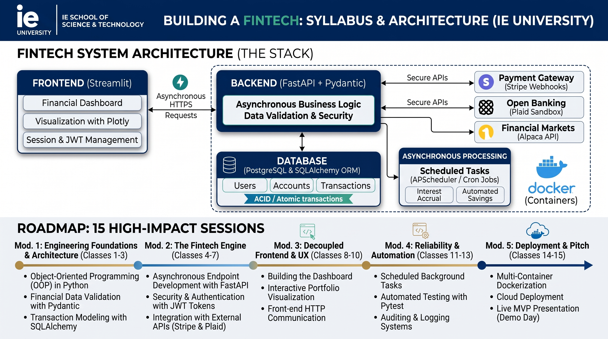
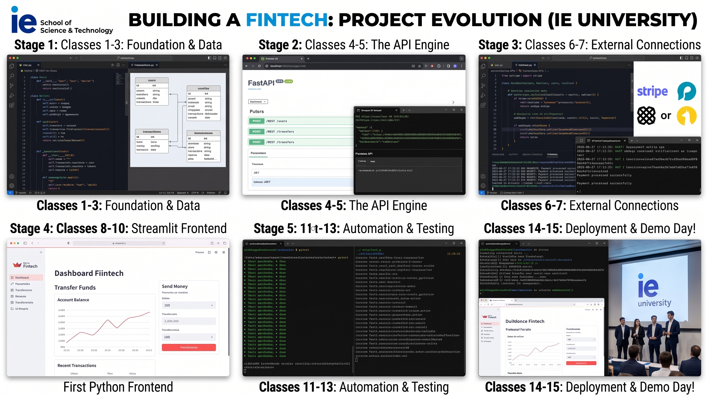

# Building a Fintech: Applied Python Architecture
**IE School of Science and Technology | Master in Financial Technology**

This repository contains the syllabus, architecture, and materials for the **"Building a Fintech"** (Python II) course. The program follows an intensive *Project-Based Learning* methodology: students will transition from writing data analysis scripts to designing, developing, and deploying a complete, secure financial software product.

The ultimate goal is to build a fully functional Fintech application (such as a Neo-bank, Robo-advisor, or payment gateway) using a modern, asynchronous, and industrial-grade tech stack.

---

## System Architecture (Decoupled Approach)

The course emphasizes an *API-First* architecture, strictly separating the transactional engine (Backend) from the user interface (Frontend), replicating current banking industry standards.

### Tech Stack
*   **Backend (Core Banking):** FastAPI, Pydantic, Asynchronous Python.
*   **Database & ORM:** PostgreSQL, SQLite, SQLAlchemy, Alembic.
*   **Security:** OAuth2, JSON Web Tokens, Passlib (bcrypt).
*   **Frontend (Client):** Streamlit, Plotly.
*   **Integrations:** Stripe API for Payments/Webhooks, Alpaca API / Plaid for Open Banking.
*   **DevOps & QA:** Docker, Pytest, APScheduler.

---

## Syllabus: 15 High-Impact Sessions

### Module 1: Engineering Foundations & Architecture (Classes 1-3)
*The goal is to lay the foundations of professional Python development and design the financial data model while adhering to ACID properties.*

*   **Class 1: The Industrial-Grade Setup & Financial OOP**
    *   Virtual environments (`uv`), strict static typing, and environment variables (`.env`).
    *   Object-Oriented Programming (OOP) applied to the transactional core (`User`, `Wallet`, `Transaction`).
*   **Class 2: Data Modeling and Validation (Pydantic)**
    *   The danger of floats in finance: Introduction to the `Decimal` type.
    *   Pydantic schemas for inputs/outputs and custom data validators.
*   **Class 3: Relational Databases and Transactionality (SQLAlchemy)**
    *   Relational models and migration management with **Alembic**.
    *   Referential integrity and concurrency control to prevent "double-spending".

### Module 2: The Fintech Engine (Classes 4-7)
*Building the secure RESTful API and connecting with the external financial ecosystem.*

*   **Class 4: Developing Asynchronous Endpoints with FastAPI**
    *   RESTful design, dependencies (`Depends`), and financial CRUD operations.
    *   Automatic and interactive API documentation (Swagger/OpenAPI).
*   **Class 5: Authentication, Security, and Tokenization**
    *   Password hashing, *salting*, and **JWT** token generation.
    *   OAuth2 flow implementation and securing private routes.
*   **Class 6: Open Banking and External API Connections**
    *   Asynchronous consumption of external APIs using `httpx`.
    *   Integration with market data (Alpaca) or banking simulators (Plaid Sandbox).
*   **Class 7: Webhooks and Event-Driven Architecture**
    *   Asynchronous events and cryptographic signatures.
    *   Payment integration via **Stripe** to securely capture fund top-ups.

### Module 3: Decoupled User Interface (Classes 8-10)
*The Frontend will consume the API as an external client using Streamlit, maintaining strict separation of concerns.*

*   **Class 8: Multi-page Architecture and State (Session State)**
    *   The **Streamlit** execution cycle and designing multi-view applications (Login, Dashboard).
    *   Using `st.session_state` to manage anonymous vs. authenticated users.
*   **Class 9: Authentication and Frontend-Backend HTTP Communication**
    *   The frontend as an HTTP client (`requests`).
    *   Connecting the Login form to FastAPI, securely storing the JWT, and injecting *Bearer Tokens* into headers to access private data.
*   **Class 10: Transactional Forms and Interactive Data Visualization**
    *   Reactive forms (`st.form`) to execute transfers by calling the API.
    *   Parsing JSON responses into Pandas DataFrames and visualizing portfolios in real-time with **Plotly**.

### Module 4: Reliability and Automation (Classes 11-13)
*A financial application cannot afford errors or manual processes.*

*   **Class 11: Automation and Background Tasks**
    *   Scheduled processing with `APScheduler`.
    *   Automating fee collection, overnight interest accrual, or *Dollar Cost Averaging* strategies.
*   **Class 12: Testing in Financial Environments**
    *   Unit and Integration testing with **Pytest**.
    *   Using *fixtures* for temporary databases and *mocking* payment gateways.
*   **Class 13: Error Handling, Logging, and Auditing**
    *   Fund traceability, record immutability, and application observability.
    *   Custom financial exceptions (e.g., `InsufficientFundsError`).

### Module 5: Integration and Deployment (Classes 14-15)
*Moving to production and product demonstration.*

*   **Class 14: Containerization and Orchestration**
    *   Packaging the application into **Docker** containers.
    *   Using `docker-compose` to spin up FastAPI, Streamlit, and PostgreSQL in sync.
*   **Class 15: Demo Day (Fintech Showcase)**
    *   Final project presentations.
    *   Live *end-to-end* demonstrations and architectural defense before the panel.

---

## Prerequisites
*   Solid understanding of Python Basics (variables, loops, functions, dictionaries).
*   Basic knowledge of Pandas and data structures.
*   Basic knowledge the command-line interface (CLI).
